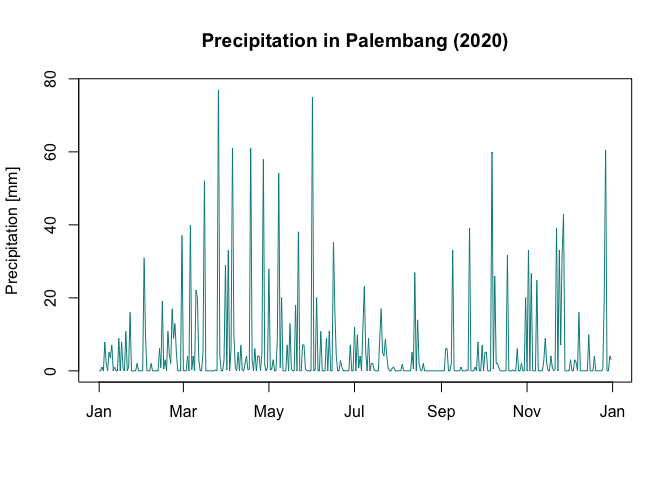
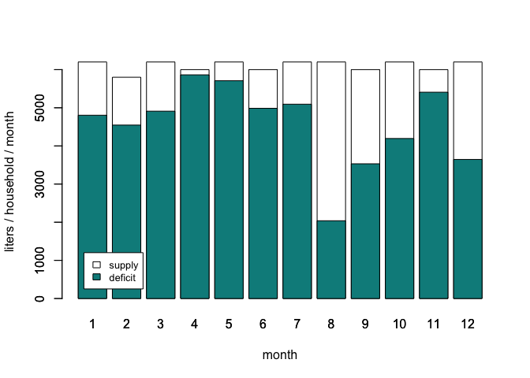
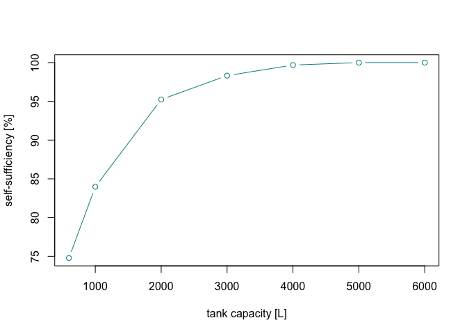

Rainwater harvesting potential estimation
================
Ricardo Ochoa, Socorro Roman, Emiliano Sosa

## rainwater package

This package was developed to assist in the planning and design stages
of rain harvesting systems. Its objective is to serve as support in the
technical analysis and basic calculations of rain harvesting systems.

## Installation and loading

You can install the package via devtools. Once that it is installed,
just call the package.

``` r
# library(devtools)
# install_github("ricardoochoa/rainwater")
library(rainwater)
```

## Data

You can load your own precipitation data. In this example we will use
one of the package data frames for Palembang City, Indonesia.

``` r
data(palembang)
head(palembang)
```

    ##   month day PRCP_mm       date
    ## 1     1   1   0.000 2020-01-01
    ## 2     1   2   0.000 2020-01-02
    ## 3     1   3   1.016 2020-01-03
    ## 4     1   4   0.000 2020-01-04
    ## 5     1   5   7.874 2020-01-05
    ## 6     1   6   2.032 2020-01-06

Let’s explore the data:
<!-- -->

## Evaluate the system potential

In this example, we will estimate the rainwater harvesting potential for
a housing unit in Palembang. We will consider that the catchment area is
100 square meters and that the water storage capacity is 600 liters.

``` r
r <- rhp(p = palembang$PRCP_mm, area = 100, tank.size = 600)
```

Summarize the results

``` r
s <- summarize_rh(r, "2020")
```

Next, we will take a look at the graphical summary. As can be seen from
the plot, most of the water demand can be solved with rainwater.

<!-- -->

Next, we will print the percentage of the water demand can be covered
with rain:

``` r
s$rain_percentage
```

    ## [1] "75 %"

Now let’s find the total rainwater usage in liters in the given year:

``` r
s$rain_volume
```

    ## [1] "54,735  L/year"

Now we will repeat all calculations for different tank capacities. We
will try 600, 1000, 2000, 3000, and 4000 liters. For this calculation we
will use the *rho* function (rainwater harvesting optimization).

``` r
R <- rho(p = palembang$PRCP_mm, area = 100, tank.size = c(600, 1000, 2000, 3000, 4000, 5000, 6000))
S <- summarize_rh(R)
S
```

    ##   tank.size   supply demand percentage
    ## 1       600 54735.06  73200   74.77467
    ## 2      1000 61467.74  73200   83.97233
    ## 3      2000 69711.30  73200   95.23401
    ## 4      3000 71968.50  73200   98.31762
    ## 5      4000 72968.50  73200   99.68374
    ## 6      5000 73200.00  73200  100.00000
    ## 7      6000 73200.00  73200  100.00000

As can be seen from the table, a tank with a capacity higher than 3000
liters results in nearly full self-sufficiency (\>98%). A tank with 6000
liters or higher capacity would result in increased costs with no
additional benefits.

Finally, we can plot the results to explain the optimal tank capacity.
<!-- -->
